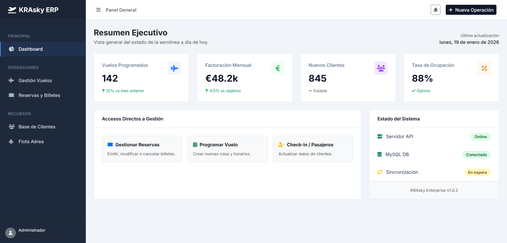
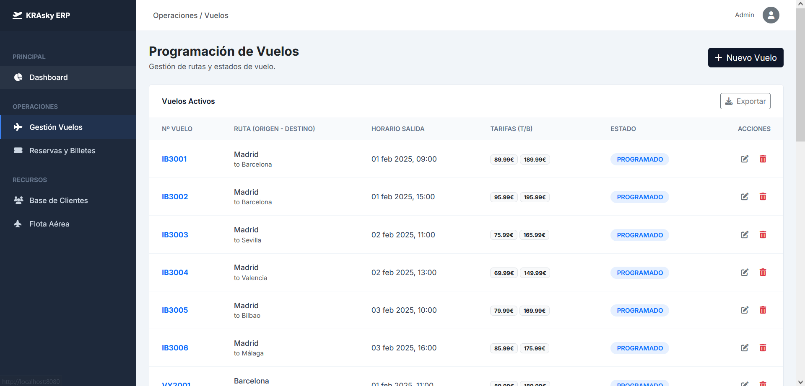
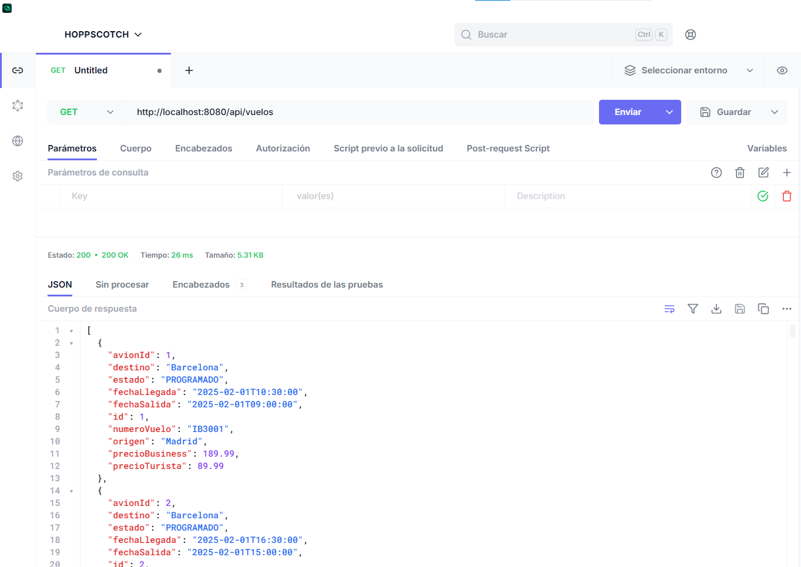
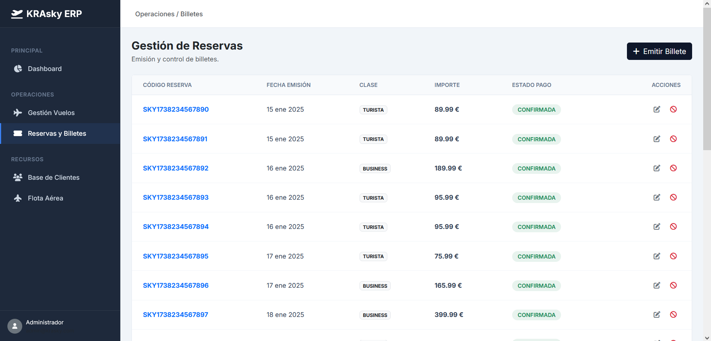
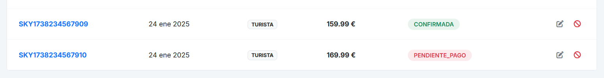
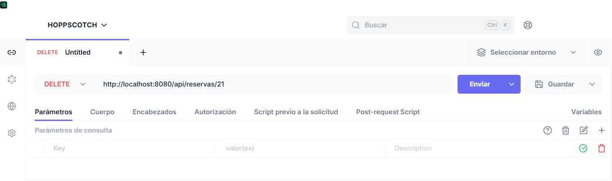
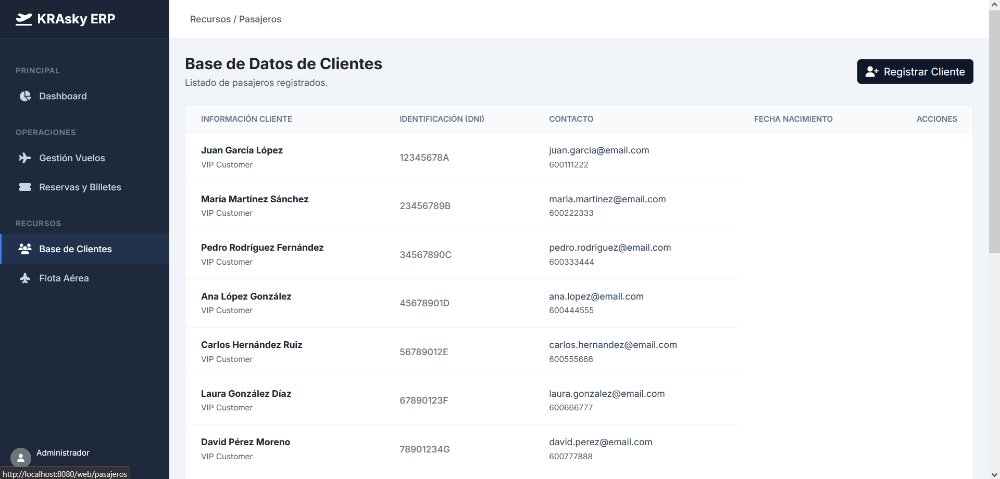
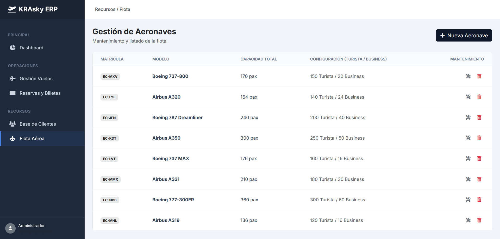
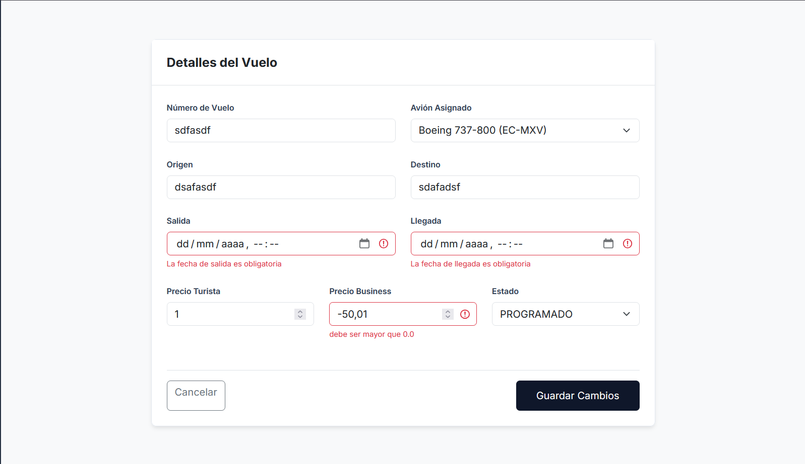

# ✈️ KRAsky ERP - Sistema de Gestión de Aerolínea

> Proyecto final para Desarrollo de Aplicaciones Multiplataforma (2º DAM).
> Un sistema integral que combina una **API RESTful** robusta con un **Dashboard Administrativo** estilo Enterprise.


## 📋 Descripción del Proyecto
Este proyecto implementa **KRAsky ERP**, una solución completa para la gestión de una aerolínea comercial. El sistema ha sido diseñado siguiendo una **arquitectura multicapa** estricta, separando la lógica de negocio, el acceso a datos y la presentación.

El sistema permite la gestión integral de:
* **Flota Aérea:** Control de aviones y capacidades.
* **Programación de Vuelos:** Rutas, horarios y estados.
* **Base de Datos de Pasajeros:** Gestión de clientes (CRM).
* **Emisión de Billetes:** Sistema transaccional de reservas con validaciones complejas.

Puedes navegar por todo el código fuente organizado en el repositorio:
📂 [Ver Código Fuente Completo](src/main/java/com/krasky/krasky)

---

## 🚀 Instalación y Puesta en Marcha

Sigue estos pasos para desplegar el proyecto en tu entorno local:

1.  **Clonar el repositorio:**
    ```bash
    git clone [https://github.com/ftorradog05-K.R.A.-Sky/krasky-erp.git](https://github.com/ftorradog05-K.R.A.-Sky/krasky-erp.git)
    ```
2.  **Base de Datos:**
    * Crea una base de datos en MySQL llamada `krasky`.
    * Configura tu usuario y contraseña en el archivo [`application.properties`](src/main/resources/application.properties).
3.  **Carga de Datos:**
    * El proyecto está configurado para generar las tablas automáticamente. Revisa la configuración de Hibernate.
4.  **Ejecución:**
    * Ejecuta la clase principal [`KraSkyApplication.java`](src/main/java/com/krasky/krasky/KraSkyApplication.java).
    * Acceso Web: `http://localhost:8080/`
    * Acceso API: `http://localhost:8080/api/`

---

## 📦 Módulos del Sistema (Documentación Visual y Técnica)

A continuación se detalla cada módulo funcional, mostrando la integración entre el Backend (API) y el Frontend (Web).

<details>
<summary><strong>📊 1. Dashboard Principal (Panel de Control)</strong></summary>

### Interfaz Web (Thymeleaf + Bootstrap 5)
El punto de entrada es un **Dashboard estilo ERP** profesional. Incluye una barra lateral fija y tarjetas KPI (Key Performance Indicators) que muestran el estado de la aerolínea de un vistazo.



### Detalles Técnicos
La lógica de navegación es gestionada por el controlador [`HomeController.java`](src/main/java/com/krasky/krasky/controller/web/HomeController.java), que renderiza la vista principal [`index.html`](src/main/resources/templates/index.html). El diseño implementa un Sidebar fijo con CSS personalizado y fragmentos de Thymeleaf para reutilizar el menú en todas las páginas.
</details>

<details>
<summary><strong>✈️ 2. Gestión de Vuelos (Operaciones)</strong></summary>

Módulo encargado de la programación de rutas y asignación de aeronaves.

### 1. Vista Web
Tabla interactiva definida en [`lista.html`](src/main/resources/templates/vuelos/lista.html) que muestra los vuelos programados. Incluye lógica visual para mostrar **Badges de Estado** con diferentes colores (Programado = Azul, Cancelado = Rojo, etc.). Esta vista es servida por el [`VueloWebController.java`](src/main/java/com/krasky/krasky/controller/web/VueloWebController.java).



### 2. Prueba API REST (Hoppscotch)
Endpoint: `GET /api/vuelos` gestionado por [`VueloRestController.java`](src/main/java/com/krasky/krasky/controller/rest/VueloRestController.java).
La API devuelve objetos **DTO** definidos en [`VueloDTO.java`](src/main/java/com/krasky/krasky/dto/VueloDTO.java) en lugar de entidades para evitar bucles infinitos y proteger la estructura interna de la base de datos.



### 3. Lógica de Negocio
* **Relación:** Implementación de `@ManyToOne` en la entidad [`Vuelo.java`](src/main/java/com/krasky/krasky/model/Vuelo.java) donde múltiples vuelos pertenecen a un único avión.
* **Validación:** El servicio [`VueloServiceImpl.java`](src/main/java/com/krasky/krasky/service/impl/VueloServiceImpl.java) gestiona la lógica de fechas y estados, apoyándose en [`VueloRepository.java`](src/main/java/com/krasky/krasky/repository/VueloRepository.java).
</details>

<details>
<summary><strong>🎫 3. Reservas y Billetes (Núcleo Transaccional)</strong></summary>

Este es el módulo más complejo, encargado de vincular Pasajeros con Vuelos y generar la facturación.

### 1. Interfaz Web
Formulario de emisión de billetes en [`formulario.html`](src/main/resources/templates/reservas/formulario.html) que valida la disponibilidad en tiempo real mediante el [`ReservaWebController.java`](src/main/java/com/krasky/krasky/controller/web/ReservaWebController.java).



### 2. Lógica de Negocio (Service Layer)
El servicio [`ReservaServiceImpl.java`](src/main/java/com/krasky/krasky/service/impl/ReservaServiceImpl.java) implementa validaciones críticas:
1.  Verifica que el vuelo y el pasajero existen.
2.  Calcula el `precioTotal` automáticamente basándose en la clase (Business/Turista).
3.  Genera un **Código de Reserva Único** (`SKY...`).

### 3. Prueba API REST
Endpoint: `POST /api/reservas` gestionado por [`ReservaRestController.java`](src/main/java/com/krasky/krasky/controller/rest/ReservaRestController.java).
Ejemplo de borrado de una reserva mediante JSON utilizando el [`ReservaDTO.java`](src/main/java/com/krasky/krasky/dto/ReservaDTO.java).




</details>

<details>
<summary><strong>👥 4. Recursos: Pasajeros y Flota</strong></summary>

Gestión de las entidades maestras del sistema.

### Pasajeros (CRM)
Base de datos de clientes definida en la entidad [`Pasajero.java`](src/main/java/com/krasky/krasky/model/Pasajero.java) con validación de **DNI único**. La gestión se realiza a través del [`PasajeroRestController.java`](src/main/java/com/krasky/krasky/controller/rest/PasajeroRestController.java) y su contraparte web.



### Flota de Aviones
Gestión de inventario de aeronaves (`Avion.java`). Implementa control de **Integridad Referencial** en [`AvionRestController.java`](src/main/java/com/krasky/krasky/controller/rest/AvionRestController.java): el sistema captura la excepción si intentas borrar un avión que tiene vuelos asignados.


</details>

<details>
<summary><strong>🛡️ 5. Control de Errores y Validaciones (Seguridad)</strong></summary>

Para garantizar la robustez del sistema y cumplir con la Fase 6 del proyecto, se ha implementado una capa transversal de manejo de excepciones que intercepta los fallos antes de llegar al cliente.

### 1. Manejador Global (GlobalExceptionHandler)
Se utiliza la anotación `@RestControllerAdvice` en la clase [`GlobalExceptionHandler.java`](src/main/java/com/krasky/krasky/exception/GlobalExceptionHandler.java) para capturar excepciones específicas en toda la aplicación:
* **`ResourceNotFoundException`:** Devuelve **404 Not Found** cuando no se encuentra un ID (vuelo, pasajero, etc.).
* **`BusinessException`:** Devuelve **400 Bad Request** cuando se viola una regla de negocio (ej: intentar reservar en un vuelo lleno, duplicar un DNI o matrícula).
* **`MethodArgumentNotValidException`:** Captura errores de validación de los DTOs (ej: precio negativo, campos vacíos).

### 2. Respuesta API Estandarizada
En lugar de devolver trazas de error de Java (Stack Traces), la API devuelve respuestas JSON limpias y comprensibles para el cliente:

**Ejemplo de respuesta ante un error de validación:**
```json
{
  "precioTurista": "El precio debe ser mayor a 0",
  "fechaSalida": "La fecha de salida debe ser en el futuro",
  "numeroVuelo": "El número de vuelo es obligatorio"
}
```


</details>

---

## ✅ Tabla de Cumplimiento de Requisitos

Este proyecto cubre el 100% de los requisitos especificados en el enunciado del Proyecto DAM:

| Fase PDF | Requisito | Estado | Enlace al Código Principal |
| :--- | :--- | :---: | :--- |
| **Fase 1** | Configuración (Maven, MySQL, Estructura) | ✅ | [`pom.xml`](pom.xml), [`application.properties`](src/main/resources/application.properties) |
| **Fase 2** | Modelo de Datos (Entidades, Relaciones, Enums) | ✅ | [`com.krasky.model`](src/main/java/com/krasky/krasky/model) (4 Entidades) |
| **Fase 3** | DTOs (Separación de capas) | ✅ | [`com.krasky.dto`](src/main/java/com/krasky/krasky/dto) (4 DTOs) |
| **Fase 4** | Repositorios (JPA y @Query) | ✅ | [`com.krasky.repository`](src/main/java/com/krasky/krasky/repository) |
| **Fase 5** | Servicios (Lógica de Negocio) | ✅ | [`com.krasky.service.impl`](src/main/java/com/krasky/krasky/service/impl) |
| **Fase 6** | API REST (Controladores y Endpoints) | ✅ | [`com.krasky.controller.rest`](src/main/java/com/krasky/krasky/controller/rest) |
| **Fase 7** | Interfaz Web (Thymeleaf + Bootstrap) | ✅ | [`templates/`](src/main/resources/templates), [`controller.web`](src/main/java/com/krasky/krasky/controller/web) |
| **Extra** | Manejo de Excepciones Global | ✅ | [`GlobalExceptionHandler.java`](src/main/java/com/krasky/krasky/exception/GlobalExceptionHandler.java) |
| **Extra** | Documentación de Pruebas API | ✅ | [`doc/hoppscotch.pdf`](doc/hoppscotch.pdf) |

---

## 🛠️ Tecnologías Utilizadas

* **Lenguaje:** Java 17+
* **Framework Backend:** Spring Boot 3 (Spring MVC, Spring Data JPA)
* **Motor de Plantillas:** Thymeleaf
* **Diseño UI:** Bootstrap 5 (Estilo Enterprise)
* **Base de Datos:** MySQL
* **Herramientas:** Maven, Lombok, IntelliJ IDEA

---

### ✒️ Autores
**Equipo KRAsky - 2º DAM**
* Alberto Jociles Ortega
* Roberto Hermoso Rejano
* Francisco Torrado Gonzalez